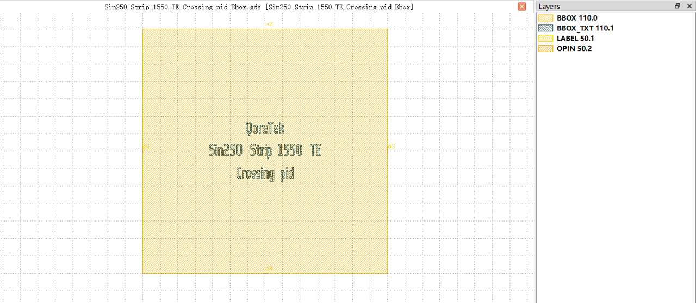

Crossing
#############################

Sin250_Strip_1550_TE_Crossing_pid_Bbox
**********************************************************

+-------------------+-----------------------------+------------------------+-------------+
|     ports         | waveguide type              | position               | orientation |
+===================+=============================+========================+=============+
| o1                | TECH.WG.Strip.C.WIRE        | (0.0, 0.0)             | 180         |
+-------------------+-----------------------------+------------------------+-------------+
| o2                | TECH.WG.Strip.C.WIRE        | (35.02, 35.02)         | 90          |
+-------------------+-----------------------------+------------------------+-------------+
| o3                | TECH.WG.Strip.C.WIRE        | (70.04, 0.0)           | 0           |
+-------------------+-----------------------------+------------------------+-------------+
| o4                | TECH.WG.Strip.C.WIRE        | (35.02, -35.02)        | 270         |
+-------------------+-----------------------------+------------------------+-------------+
