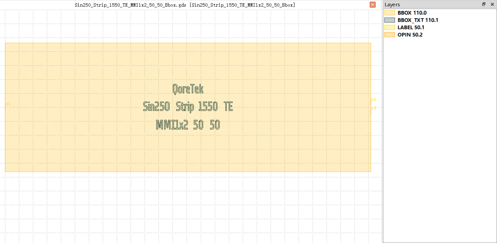

1x2 MMI
##########################################################

Sin250_Strip_1550_TE_MMI1x2_50_50_Bbox
**********************************************************

+-------------------+-----------------------------+------------------------+-------------+
|     ports         | waveguide type              | position               | orientation |
+===================+=============================+========================+=============+
| o1                | TECH.WG.STRIP.C.WIRE        | (0.0, 0.0)             | 180         |
+-------------------+-----------------------------+------------------------+-------------+
| o2                | TECH.WG.STRIP.C.WIRE        | (130.84, 1.6)          | 0           |
+-------------------+-----------------------------+------------------------+-------------+
| o3                | TECH.WG.STRIP.C.WIRE        | (130.84, -1.6)         | 0           |
+-------------------+-----------------------------+------------------------+-------------+
