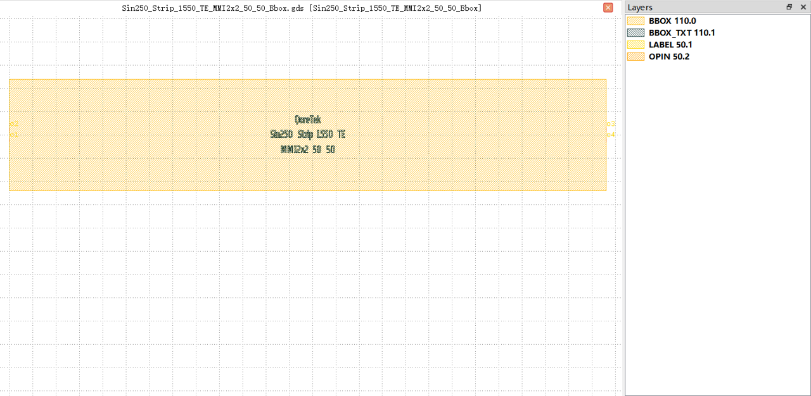

2x2 MMI
##########################################################

Sin250_Strip_1550_TE_MMI2x2_50_50_Bbox
**********************************************************

+-------------------+-----------------------------+------------------------+-------------+
|     ports         | waveguide type              | position               | orientation |
+===================+=============================+========================+=============+
| o1                | TECH.WG.STRIP.C.WIRE        | (0.0, -2.323)          | 180         |
+-------------------+-----------------------------+------------------------+-------------+
| o2                | TECH.WG.STRIP.C.WIRE        | (0.0, 2.323)           | 180         |
+-------------------+-----------------------------+------------------------+-------------+
| o3                | TECH.WG.STRIP.C.WIRE        | (256.0, 2.323)         | 0           |
+-------------------+-----------------------------+------------------------+-------------+
| o4                | TECH.WG.STRIP.C.WIRE        | (256.0, -2.323)        | 0           |
+-------------------+-----------------------------+------------------------+-------------+

