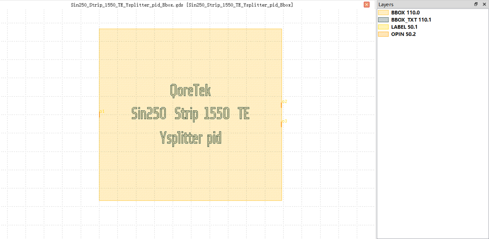

Y Splitter
##########################################################

Sin250_Strip_1550_TE_Ysplitter_pid_Bbox
**********************************************************

+-------------------+-----------------------------+------------------------+-------------+
|     ports         | waveguide type              | position               | orientation |
+===================+=============================+========================+=============+
| o1                | TECH.WG.STRIP.C.WIRE        | (0.0, 0.0)             | 180         |
+-------------------+-----------------------------+------------------------+-------------+
| o2                | TECH.WG.STRIP.C.WIRE        | (49.52, 2.63)          | 0           |
+-------------------+-----------------------------+------------------------+-------------+
| o3                | TECH.WG.STRIP.C.WIRE        | (49.52, -2.63)         | 0           |
+-------------------+-----------------------------+------------------------+-------------+
